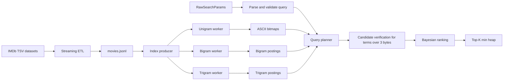

# IMDb Autocomplete Engine in Go

A custom in-memory search engine built over approximately 12.7 million IMDb movie, television, and video titles.

The engine exposes case-insensitive substring search across multiple query terms in any order using:

- Bitmap indexes for single-character ASCII terms.
- Inverted bigram and trigram posting lists.
- Concurrent streaming index construction.
- Candidate verification for exact substring semantics.
- Bayesian ranking and bounded top-K selection.

The project started as a trie-based autocomplete exercise and evolved into an exploration of indexing, query execution, memory layout, concurrency, and performance engineering at real-world dataset scale. Its [design history](docs/design-history.md) documents that progression.



## Performance Highlights

The full-corpus figures below are a historical baseline from 2026-08-19 at commit `f88c616`, before the HTTP service and query-aware ranking changes. The [2026-08-20 query-aware ranking record](docs/benchmarks/2026-08-20-query-aware-ranking.md) contains the current focused 100,000-record comparison and its documented latency/memory tradeoff.

| Measurement | Result |
| --- | ---: |
| Dataset | 12,699,818 IMDb titles |
| Index build | 35.61 s |
| Peak RSS | 8.24 GiB |
| `Star Wars` search | 30 ms |
| `Star Wars` matches | 8,179 |

The prior deterministic 100,000-record snapshot is recorded in [the 2026-08-19 performance record](docs/benchmarks/2026-08-19-current-performance.md). The bitmap unigram percentages are a [historical 2026-08-12 comparison](docs/benchmarks/2026-08-bitmap-unigram-search.md), not a comparison with the current parsed-parameter API.

## Design Decisions

| Decision | Why |
| --- | --- |
| Inverted n-gram index instead of a trie | Fixed-size grams are retrieved by exact key, so prefix-tree traversal adds complexity without improving the substring workload. |
| Bitmap unigrams | Single-character postings are dense. Dense record slots let the engine intersect ASCII terms with word-level bit operations rather than allocating large candidate sets. |
| Posting lists for bigrams and trigrams | Longer grams are less dense, making compact ID lists a better memory tradeoff than allocating a full bitmap per gram. |
| Worker-owned indexes | Each n-gram worker exclusively owns its mutable index, avoiding concurrent map mutation and hot-path locks during construction. |
| Candidate verification | Intersecting trigrams can admit false positives for longer query terms; verification restores exact substring semantics. |
| Fixed-size min-heap | The engine keeps only the requested top results instead of sorting every match, while still reporting an exact match count. |
| Streaming JSONL ingestion | Records are decoded and dispatched one at a time, avoiding retention of raw source data while the index is built. |

## Current Architecture

### Data pipeline

The ETL program downloads two official IMDb datasets:

- `title.basics.tsv.gz`
- `title.ratings.tsv.gz`

It joins records by `tconst`, converts IMDb's TSV records into `movies.Movie` values, and writes one JSON object per line to `data/movies.jsonl`.

The importer streams both compressed input files and streams JSONL output. The generated files are ignored by Git because they are large and IMDb data is refreshed regularly.

### Index construction

The application reads `data/movies.jsonl` one record at a time. A producer:

- Stores each complete movie record by ID alongside a precomputed Bayesian rating and normalized primary title.
- Sends a small indexing job to each n-gram worker.

Worker 1 builds one bitmap for each ASCII byte. Each bit is addressed by a dense record slot, allowing one-character query terms to be intersected efficiently with bitwise operations. Workers 2 and 3 build deduplicated inverted posting lists for byte bigrams and trigrams, keyed by raw movie ID.

This avoids concurrent map writes without putting locks on the indexing hot path.

### Search

`GET /search` accepts a required `q` parameter and an optional `limit` parameter. The handler defaults an omitted limit to `10`, parses the request into `RawSearchParams`, and returns `400 Bad Request` for malformed input. `ParseQuery` trims and lowercases the term, validates supplied limits from `0` through `100`, and returns validated `SearchParams` for `Search` to execute.

ASCII one-character query terms use bitmap intersection directly. Two- and three-byte terms use bigram and trigram posting lists; longer terms intersect their trigrams to retrieve candidates, then verify the complete term with case-insensitive substring matching. Mixed queries first retrieve multigram candidates and filter them through the relevant unigram bitmaps. Query words may appear in any order.

`Search` returns a `SearchResult` containing the total number of matching records and up to the requested number of full `movies.Movie` values. Results are selected with a fixed-size min-heap and sorted by a query-aware score: Bayesian rating plus a `0.2` exact-title boost or `0.1` title-prefix boost. Movie ID is used as the descending tie-breaker. The heap calculates title relevance only for candidates that can still enter the requested top K.

The Bayesian score combines:

- The IMDb average rating.
- The number of IMDb votes.
- A global-average prior of `6.5`.
- A minimum-vote prior of `1,000`.

Titles without a ratings record use `NumVotes: 0` and no average rating, causing them to rank below rated titles.

## Setup

The project requires Go 1.25.1 or newer, as specified in `go.mod`.

IMDb data is not checked into the repository. The ETL command downloads it locally.

## Generate Data

Run the ETL program from the repository root:

```bash
go run ./cmd/etl
```

This downloads the current IMDb title and ratings files and generates:

```text
data/movies.jsonl
```

The source downloads are stored locally as:

```text
data/title.basics.tsv.gz
data/title.ratings.tsv.gz
```

These files, along with the generated JSONL file, are ignored by Git.

IMDb provides these datasets for personal and non-commercial use subject to its terms. Review the [IMDb dataset terms](https://developer.imdb.com/non-commercial-datasets/) before using or redistributing the data.

## Run Search

After generating `data/movies.jsonl`, start the server:

```bash
go run .
```

The application builds the index once, then serves searches on port `8090`:

```bash
curl 'http://localhost:8090/search?q=Star+Wars&limit=10'
```

`q` must be nonblank. `limit` is optional, defaults to `10`, and must be an integer from `0` through `100`; `0` returns only the match count. The response is plain text and includes the matching records and total count.

## Testing

The test suite can be run with:

```bash
go test ./...
```

Race conditions can be checked with:

```bash
go test -count=1 -race ./...
```

### Code Coverage

Per-package code coverage can be reported with:

```bash
go test -count=1 -cover ./...
```

Per-function code coverage can be reported with:

```bash
go tool cover -func=/tmp/go-autocomplete.cover
```

Executed and missed statements can be viewed in the browser with:

```bash
go tool cover -html=/tmp/go-autocomplete.cover
```

#### Benchmarks

Benchmark collection instructions and dated performance records are in [docs/benchmarks](docs/benchmarks/README.md). The current snapshot is [2026-08-19](docs/benchmarks/2026-08-19-current-performance.md); the [bitmap unigram record](docs/benchmarks/2026-08-bitmap-unigram-search.md) documents its historical optimization comparison.

## Known Limitations

- Searches operate on `PrimaryTitle`; `OriginalTitle` is retained but not indexed.
- Index construction is capped at 13,000,000 records.
- The HTTP search limit must be between `0` and `100`; `0` returns only the match count.
- There is no minimum query length. Common one-character ASCII queries can require scanning and ranking a large bitmap intersection, while two-character and longer queries can produce large posting-list candidate sets.
- Bigram, trigram, and mixed queries materialize candidate ID sets before top-K ranking. Pure ASCII unigram queries stream bitmap intersections instead.
- Exact match counts and ranking require scanning every candidate that survives index filtering. Full substring verification is additionally required for query words longer than three bytes.
- Only ASCII one-byte query terms use bitmap intersections. Non-ASCII terms use the byte bigram/trigram path, so their performance characteristics differ.
